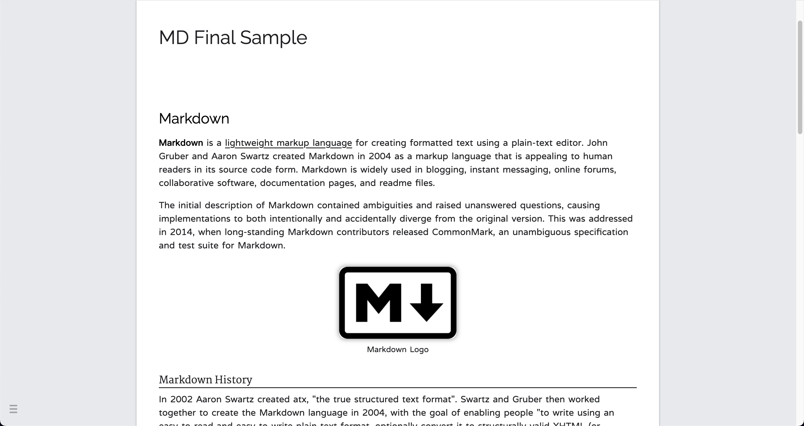
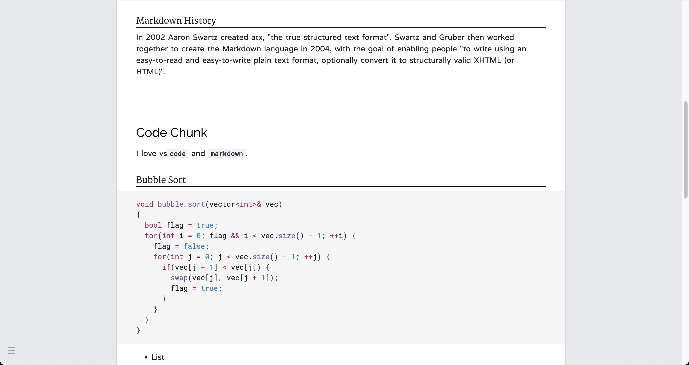
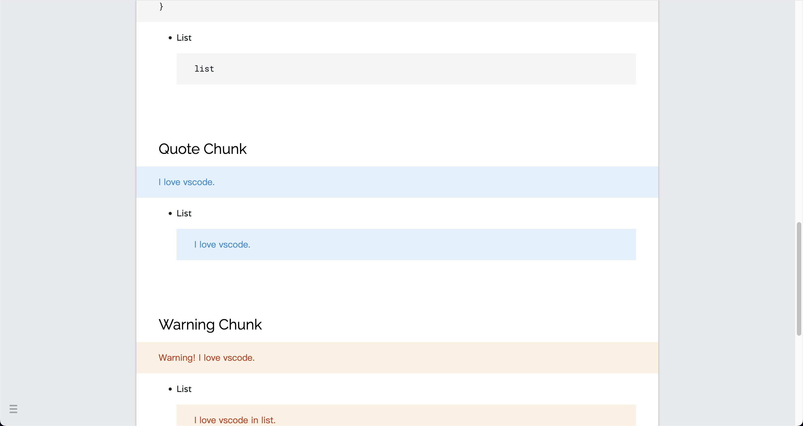
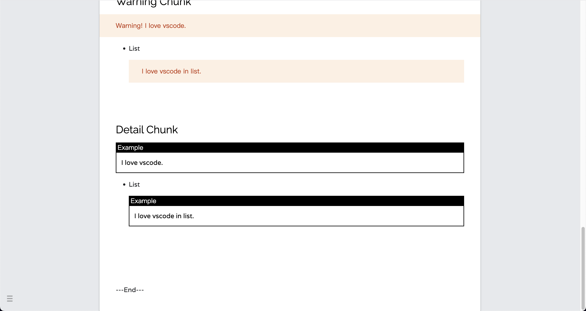

# Markdown Google Style

This is wrote based on VSCode+MarkdownPreviewEnhanced.

Most of code just copy the source code from [here](https://developers.google.com/protocol-buffers)

## Install

To use this custom style, you need to install 5 fonts to your system which is easy to get from [google fonts](https://fonts.google.com):
- Raleway
- Martel
- Varela
- Roboto Mono for Powerline
- Roboto Mono Medium for Powerline

Then open VSCode:
1. cmd+shift+p
2. Enter "Custom CSS"
3. Replace **all** origin text with Style.css

## Feature
- Custom Header1, Header2, Header3.
- Limit width to 862px and add shadow to whole page.
- Rounded border and shadow for images, and you can add figure name like this:
  ```
  <div align=center class=img></br>figure name</div>
  ```
- Custom code chunks and reference chunks, add warning chunks.
- Image with shadow, you can also add image name
- etc.

## Illustration




