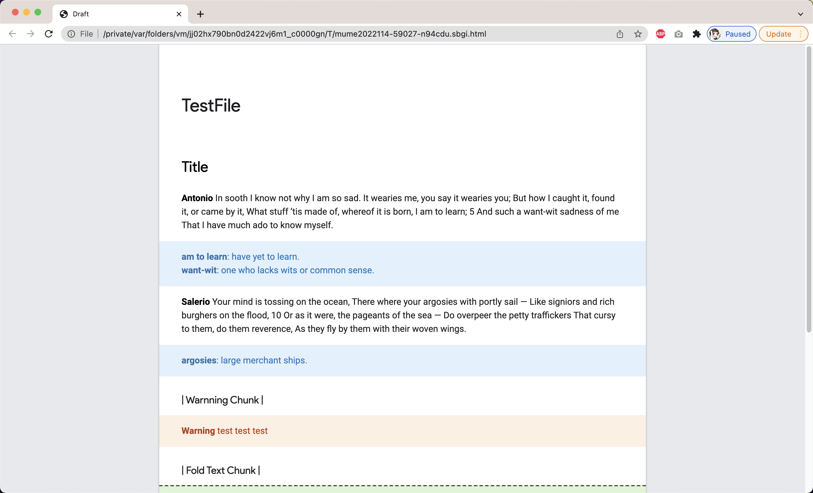
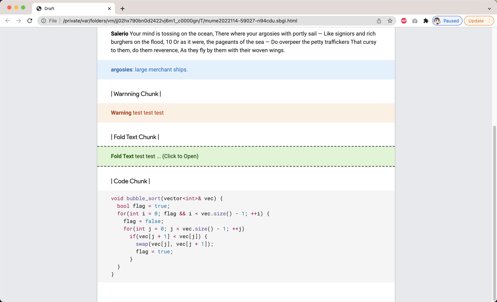

# Markdown-CustomCSS-GoogleStyle

This is wrote based on VSCode+MarkdownPreviewEnhanced.

Most of code just copy from the source code of [here](https://developers.google.com/protocol-buffers)

## Install

You need to install 2 fonts: "Product Sans", "Roboto".
Both of them are easy to get from the internet.

Then open VSCode:
1. cmd+shift+p
2. Enter "Custom CSS"
3. Replace text

## Illustration

